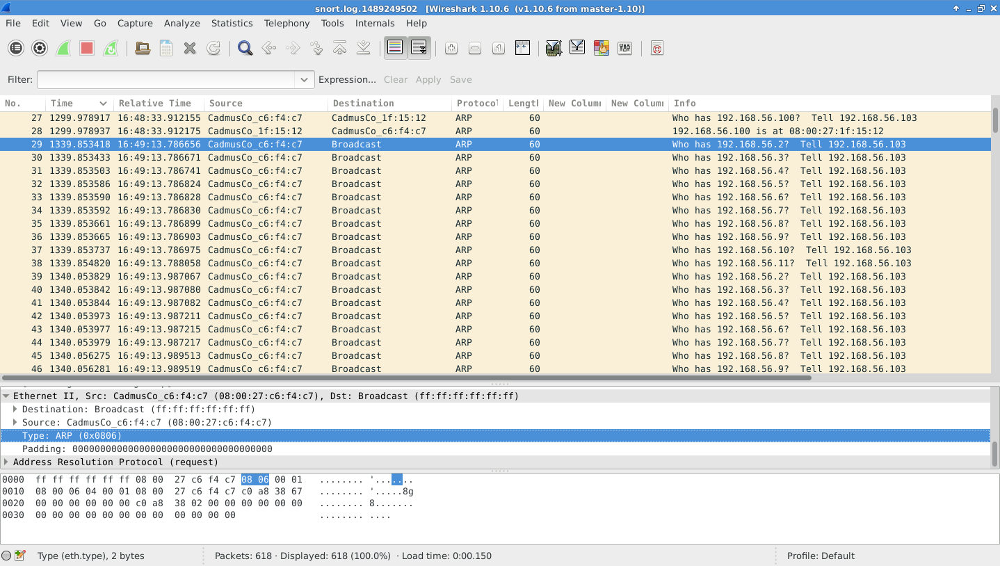
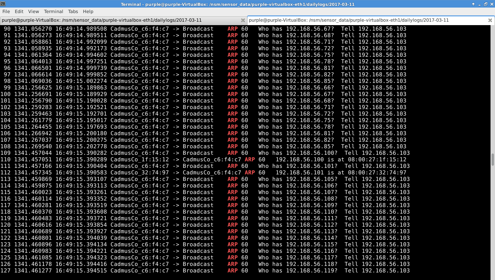
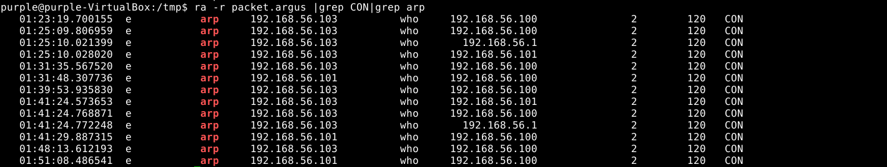
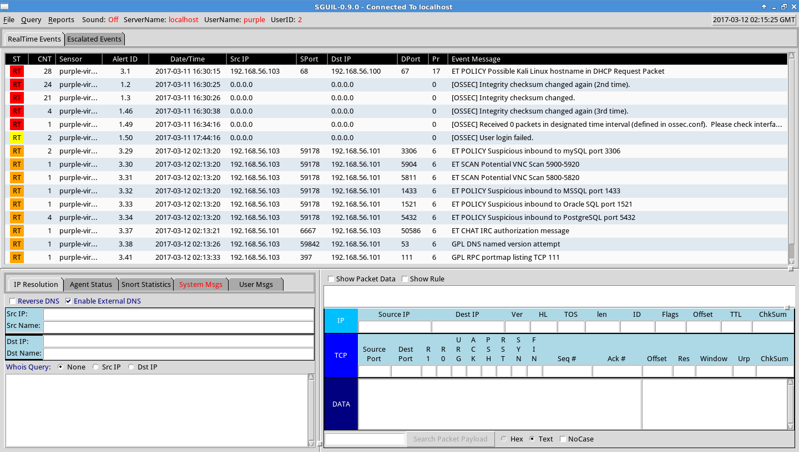
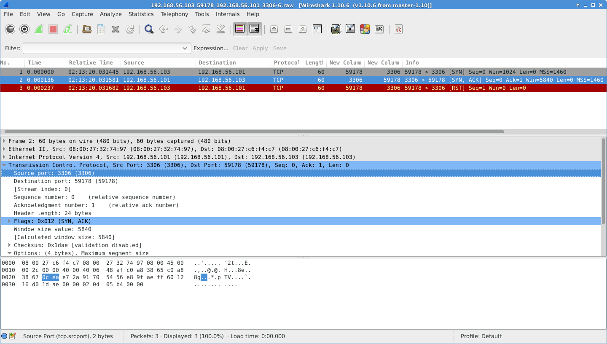
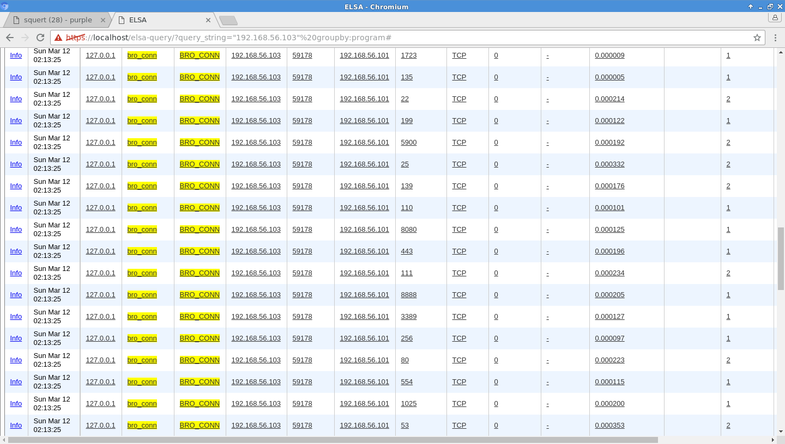
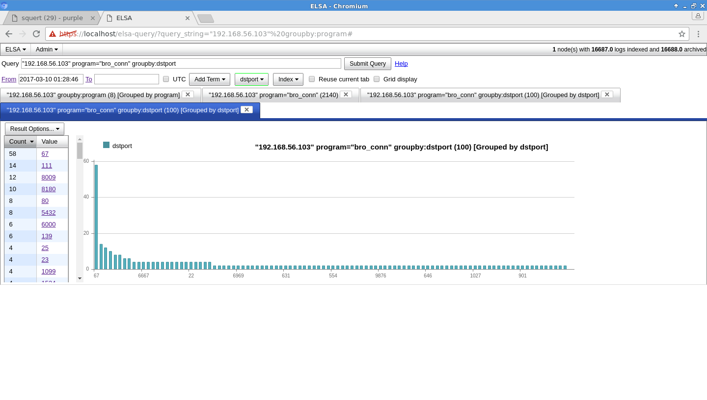

# Purplebox Overview
A Purplebox setup takes the concept of "hacklabs" to the next level by combining it with the SecurityOnion NSM (Network Security Monitor) which provides you greater visibility into your attacks and the effects they have on the wire. PurpleBox gets its name from the concept of a "Purple Team", being the observer/unifier between BlueTeam and RedTeam operations that provide a proper narrative of the events that took place.

This setup will assist you in properly recording that narrative as systems are attacked and also fascilitate analysis of the systems for forensic artifacts. This setup can be used as a training aid or just a great way to complete various PCAP centric CTFs/forensics challenges available online. Not only can you use this for monitoring in real time, but it is trivial to play back old PCAP data using tcpreplay and get the same effect. 

The setup fascilitates greater insight to both Offensive and Defensive Cyber Operations by allowing post engagement analysis that highlights exactly what happened on the wire. On the one hand it allows BlueTeam to hunt for and develope new indicators of compromise, while also allowing RedTeam to visualize how its attacks could be detected by BlueTeam and provides deeper understanding of various attack methodologies. Basically, if you want an FOSS hacklab that goes beyond simple virtualizing boot-to-roots and helps you truly understand what's going on behind the scenes, then this is the kind of setup you want.

# Basic Setup
- **Virtualbox** - This tutorial will use Virtualbox, but the same setup could easily be repeated across any modern hypervisor. This tutorial assumes you are able to locate and install that software on you own. 

- **Security Onion** - At its core a Purplebox utilizes the SecurityOnion NSM (Network Security Monitor) created by Doug Burks at Security Onion Solutions, which itself combines many of the giants in the opensource network security monitoring and analysis realm such as: Bro, Snort, Surricata, Wireshark, ELSA, Netminer, Sguil, Xplico, Squert, and many more into one easy to setup system that can record and analyse network traffic. 

You can locate the ISO for SecurityOnion at their [Github Account](https://github.com/Security-Onion-Solutions/security-onion/blob/master/Verify_ISO.md), download the ISO and follow the instructions on the download page to ensure you have a valid copy of SecurityOnion. A very thorough walkthrough for installing SecurityOnion on Virtualbox is located on their [Github Wiki](https://github.com/Security-Onion-Solutions/security-onion/wiki/IntroductionWalkthrough). 

The only place you will deviate from this Walk Through is when you get to your network interface setup in virtualbox settings. You will set your first adapter (your management interface) to "Bridged" (this basically treats the system as if it were another computer connecting to your wireless router) and the second adapter to "Host-Only Adapter" instead of "Internal". This is the adapter that will be used for sniffing traffic, and since the idea is that you may also be running boxes that are insecure by design (ie. Metasploitable), we need to ensure we are limiting the range our virtual environments have, especially if we are connected to the internet. Also for the sake of simplicity, running the system in evaluation mode should work fine for our purposes.

- **Attack System** - After you've completed the setup of your NSM you can go ahead and install your attack machine, for this tutorial we'll be utilizing [Kali](https://www.kali.org/). Regardless of which systems you choose just remember to also give it Network Adapters configured for "Host-Only" otherwise they won't be able to connect to the "Host-Only" network your vulnerable box SHOULD be on. You may opt to add an additional "Bridged" adapter to your attack machine, doing so will allow you to reach the internet and install additional software. However bear in mind, if you do this you will likely need to create a new interface entry in the bottom of your /etc/network/interfaces file such as:

~~~~
auto eth1
iface eth1 inet dhcp 
~~~~

After doing this be sure to run:

> kali-root#  **sudo ifup eth1**

and your new interface should pull an IP for your routers DHCP pool, be sure to confirm by checking ifconfig.

- **Vulnerable System** - Next, you will install your Vulnerable System, there are many great boot-to-roots available for practice on [Vulnhub](http://www.vulnhub.com), for this tutorial we'll be using [Metasploitable2](https://www.vulnhub.com/entry/metasploitable-2,29/). Regardless of which systems you choose just remember to also give it Network Adapters configured for "Host-Only" again this is because you are placing a purposefully vulnerable system on your network, and want to limit it's exposure as much as possible.

- **Verify Connectivity** - After you've done so, verify connectivity by ensuring each system can be reached by the other via ping request. Then perform one final test by running a full Nmap -A scan on your vulnerable system from your attack system, if all goes right you'll see sguil (in Security Onion) light up like a christmas tree with all of the alerts it receives. 

# Walkthrough
Now that you have your system setup, lets go through some basic network analysis with SecurityOnion as our surveillance system. We'll start where all good attacks start. 

## The Recon
Now from a BlueTeam perspective obviously your enemy has already done their passive recon, whois lookups, internet archives, basic OSINT research. While there are some steps we can take to limit the ammount of breadcrums we provide for our attacker. We probably won't be able to detect much of that passive recon, but as soon as their recon turns from passive to active network recon, we'll get our earliest indicators that someone is up to no good, and obviously the earlier we can detect them within the [Cyber Killchain](http://www.lockheedmartin.com/content/dam/lockheed/data/corporate/documents/LM-White-Paper-Intel-Driven-Defense.pdf) the better positioned we will be to prevent them from doing further damage to our network.

Utilizing the examples provided by [pentest-standard.org](http://www.pentest-standard.org/index.php/Intelligence_Gathering#Active_Footprinting) for Active Recon. We will start with the most common method.

#### Scanning
In order to get a general lay of the LAN, we will perform a simple network ping sweep/scan from my Kali box. For this, we will utilize [Nmap](https://nmap.org/book/man.html) as follows:

> kali-root#  **nmap -sn 192.168.56.1-255**

**IMAGE PLACEHOLDER**

This is called a "No Port Scan" by nmap and it will allows us to scan a range of IPs using the above range notation or CIDR / notation. This will let us know by IP address how many systems are responding on the network. 

According to the nmap man page 

> *"default host discovery done with -sn consists of an ICMP echo request, TCP SYN to port 443, TCP ACK to port 80, and an ICMP timestamp request. When executed by an unprivileged user, only SYN Packets are sent (using a connect call) to port 80 and 443 on the target. **When a priviledged user tries to scan targets on a local ethernet network, ARP  requests are used unless --send-ip was specfied.**" -nmap manpage*

Note the information in bold is important when using a systems root user (which is considered bad practice but common among people running Kali), also note that this type of scan is considered to allow:

> *"Light reconnaissance of a target network without attracting much attention." -nmap manpage*

Now you will notice that when using SecurityOnions default settings, this scan does not generate any alerts in sguil or logs in elsa for that matter, however there are many tell-tale signs (network forensic artifacts) within SecurityOnion that there has been communications from our attack box to the rest of our network. So lets see what we can find.

Since we know what the answer to this test is, let's start our hunt by looking for ARP(Address Resolution Protocol) requests. Since ELSA and Sguil came up with no freebies in the alert department, lets go straight to our packet capture data located in 

**/nsm/sensor_data/\<interface\>-eth1/dailylogs/timestandedfolder/**

In this folder you will find files labeled like "snort.log.1234567890" these are your pcap files for that day and the numbers at the end are the [unix epoc](https://en.wikipedia.org/wiki/Unix_time) time-stamps for each log (basically the start time).

##### Wireshark Method

Now this wouldn't be realistic in most situations as these pcaps on a gigabit network would be significantly larger and would likely kill your poor wireshark instance. But for our lab the packet is relatively small and using the wireshark gui will is the easiest way to start understanding what's going on in your packets.

> securityonion-user$ **wireshark snort.log.1234567890**

Now because we already know we are looking for ARP requests as per the nmap man page about -sn scans, lets sort our packets by protocal by clicking the "Protocol" header. (Alternatively we could have simply applied a display filter with the "arp" filter) Looking through the data in wireshark shows us exactly what we expected to see. You see the source is the MAC Address of your attack machine sending ARP Requests to the broadcast address, effectively asking everyone on the net who has a given IP address and for them to forward that information to the IP of our attack machine (as seen in the Info column). These requests run all the way from 1-255 just as our nmap command directed. We will also see (as in packet 28) that we can tell who gave up the goods about being alive on the net.

 

##### TShark Method

Alternatively we could have achieved similar results with tshark, the commandline version of wireshark, but this time we can streamline our search by piping our pcap into grep and look directly for ARP requests and piping it again through less to easily search through the results. This method would also be more realistic for searching through large pcaps.

> securityonion-user$ **tshark -r snort.log.123456890 |grep ARP|less**

 

##### ARGUS method

Yet another method would be to use the flow tool ARGUS (Audit Record Generation and Utilization System), this method requires that we first convert our our snort.log.1234567890 file to a flow format, to do this, run the following

> securityonion-user$ **argus -r snort.log.1234567890 -w /tmp/packet.argus**

This command takes our snort file as input using -r and writes it to the /tmp/ directory as packet.argus using the -w switch. Now that it's in a format our program understand we can run ra (read argus) in order to read our newly created argus file.

> securityonion-user$ **ra -r packet.argus - 'src host 192.168.56.103' | grep arp | grep CON**

This command allows shows us only successful arp connections ('src host 192.168.1.56.103' not shown in image, but allows you to narrow your search to only flows originating from .103). For us, this means that our attack machine 103, has successfully enumerated systems .100, .1, and .101

 

#### Banner Grabbing

Now that the attacker has successfully determined what systems are up on the network, his next step is to enumerate the ports that are available for connection on the IPs we acquired and possibly identify what software is running on that port. This is known as banner grabbing. One of the simplest ways to do this is by using NMAP as follows: 

> kali-root#  **nmap -sV 192.168.56.101**

**IMAGE PLACEHOLDER**

The -sV scan or "Version Detection" scan will attempt to connect to various ports and capture the banners provided by them, for the attacker this provides more detailed information about what is actually running on that port. However, since that is making actual connections, this type of scan makes significantly more noise and is quickly picked up by SecurityOnions default configuration. As shown in the image below, everything from Alert ID 3.29 and down are artifacts found by Snort after running this scan.

From here we can easily pivot from Sguil into Wireshark to see the connections made. To do this rightclick the "Alert ID" of our first suspicious Alert ID - 3.29, then select "Wireshark". This opens that TCP stream for us to investigate further.

As you can see our Kali box at IP 192.168.56.103 started a 3 way handshake with our Metasploitable box at IP 192.168.56.101 on port 3306 (mySQL) and then abruptly resets the connection after it got the information it needed.

Analysing the next two hits (using the same method to reach them in wireshark) we see the two attempts that were made on ports 5904 and 5811 were replied back with RST/ACKs, which means nothing is listening on that port, and yet our Kali box tells us that it successfully found VNC on port 5900. This tells us we missed something. 

So instead of looking deeper into those two TCP streams in wireshark, lets Pivot to ELSA from SGUIL by rightclicking the IP Address of our attacker x.x.x.103 and Select "ELSA IP LOOKUP" and then select "SRC IP". Authenticate into ELSA and if all goes well you'll be greated with a bar graph showing you the various logs that are available for you to assess.

We will start with the bro_conn logs to see what connections were made from this IP Address. To ensure we see everything, change the paging box from 15 to 500, this will allow us to see more of the logs in one shot, also to make these logs easier to read, check the "Grid Display" box.

Alright, well it should seem pretty odd that we have one IP trying to talk to another IP using a bunch of different ports, that's not normal. To give this a better view, lets uncheck "Grid Display" again and then click one of the links that reads "dstport()".

Much better, now we have a nice little chart on the left that shows all of the ports our badbox was trying to reach out too. A quick and dirty way to evaluate this is that if a port has a count of under 3 connections then a connection was likely unsuccessful, because a 3wayhandshake takes at least 3 interactions to complete, this is ofcourse assuming that there was only one scan. Now going off of this logic anything over a count of 2 likely replied by with a syn/ack and provided our kali box with information about its configuration. Indeed this information coorilates to the information obtained by our Nmap Scan.

Now that the attacker has done his initial recon, he is ready to launch his first set of attacks on the system.

## Exploitation

 To be continued.

# References

1 https://www.virtualbox.org/manual/

2 https://github.com/Security-Onion-Solutions/security-onion/wiki

3 https://groups.google.com/forum/#!forum/security-onion

4 http://www.lockheedmartin.com/content/dam/lockheed/data/corporate/documents/LM-White-Paper-Intel-Driven-Defense.pdf

5 http://www.pentest-standard.org/index.php/Intelligence_Gathering#Active_Footprinting

